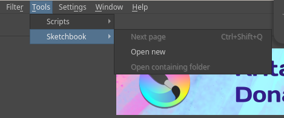
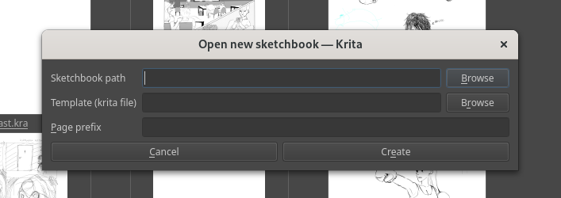

# Sketchbook plugin

## Screenshots
 

## Installation
- Add `sketchbook` folder, `actions` folder and `sketchbook.desktop` file to your `pykrita` folder (optionally add `sketchbook.action` file to your `actions` folder).
- Then open krita and enable this plugin by going to `Settings > Configure Krita... > Python Plugin Manager`.  
- Finally, restart krita.
- In case of troubles refer to [krita manual](https://docs.krita.org/en/user_manual/python_scripting/install_custom_python_plugin.html).  

## Usage
You can use sketchbook plugin by going to `Tools > Sketchbook` or by defining shortcuts.  
For more details refer to [manual](https://saysaeqo.github.io/krita-scripts/sketchbook/manual.html).

# Other scripts
Other scripts can be used with `Ten Scripts` builtin plugin. Enjoy!

# Changelog

- Added exporting as page (without need to create new empty document after saving current page)
